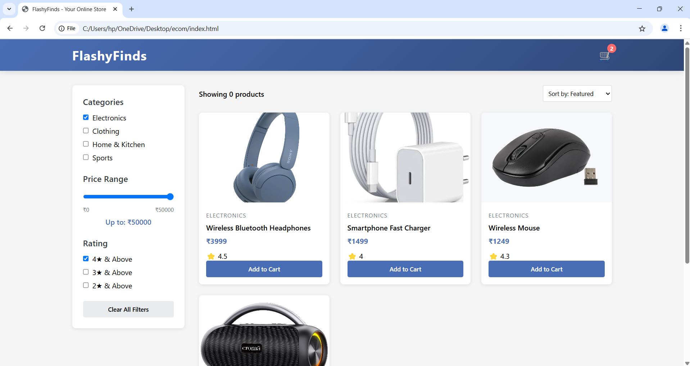

# FlashyFinds 🛍️

FlashyFinds is a simple, responsive e-commerce web app built using vanilla HTML, CSS, and JavaScript. Users can browse products, filter by category and price, search by name, add items to cart or wishlist, and view their shopping list with total amount.

---

## 🚀 Features

- 🧾 Product Listing: Browse a grid of products with images, prices, categories, and ratings.
- 🛒 Shopping cart with real-time updates
- 🧠 Category and price range filtering
- 📦 Product sorting (price, rating)
- 🖼️ Real product images from free sources
- 📱 Responsive design

---

## 📋 Getting Started
Clone or Download this repository.

Add Images
Place product images in an images/ folder in the project root.
Image filenames should match those referenced in script.js (e.g., wbh.jpg, tshirt.jpg, etc.).

Open index.html
Double-click or open index.html in your browser.
No server or build step required!

---

## 🖼️ Screenshots

---

## 📹 Video

---

## ✨ Deployed

- https://onkar-kambale.github.io/Flashy-Finds/
